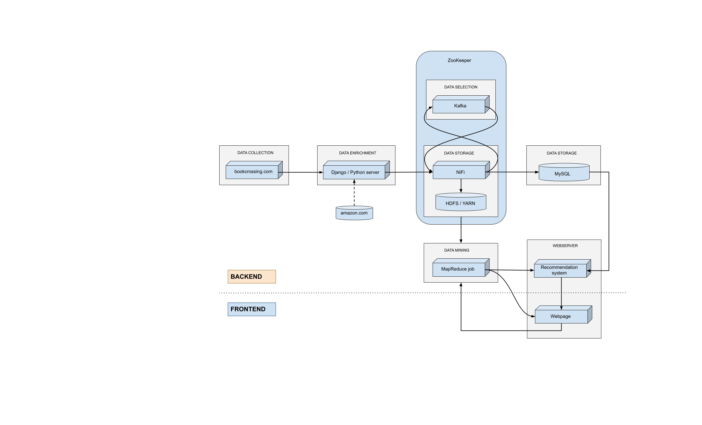
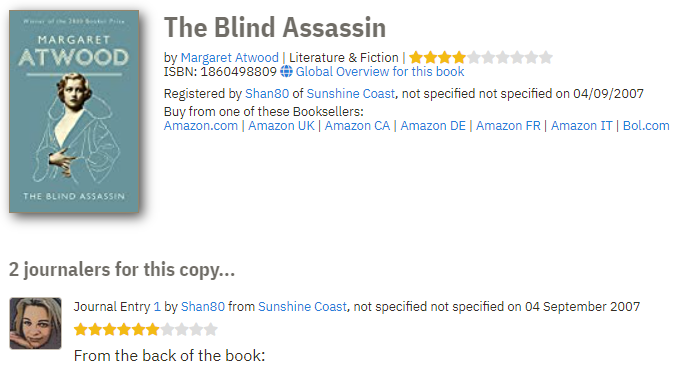
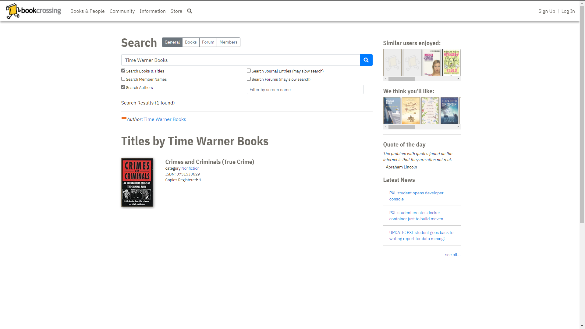

# Project Herexamen Data Mining Jim Vekemans

### Environment setup
1. Build [Hadoop Docker cluster](https://github.com/big-data-europe/docker-hadoop/archive/refs/tags/2.0.0-hadoop3.2.1-java8.zip)
2. Mount files from this repo in fastai container. <i>*Replace {DIRECTORY} with path where you cloned this repo*</i> ```docker run --init -it --rm --gpus all -p 8888:8888 -v {DIRECTORY}:/workspace/code fastdotai/fastai:2.2.5 ./run_jupyter.sh```
3. Download [Bookcrossing dataset](https://www.kaggle.com/arashnic/book-recommendation-dataset/download)
4. Run Recommenders_dataprep.ipynb
5. Copy mapred_data_{0-9}.csv to docker: ```docker cp ./mapred_data_{0-9}.csv```
6. Install maven dependencies and generate JAR-file -> open this repository in vscode and click "reopen in container". The JAR-file should be in target folder after container has been built

## Projectomschrijving

Een hypothetische data-pipeline beschrijven met uitgewerkte MapReduce implementatie en Recommendation system.

## Dataset

Voor deze individuele opdracht 'Data Mining' is er gekozen voor een dataset bestaande uit drie tabellen: users, books en ratings. In 2004 is gedurende vier weken data verzameld van gebruikers en gebruikerreviews op de website bookcrossing.com. Nadien is er op Amazon Web Services (AWS) informatie afgehaald over de boeken in de gebruikerreviews. Wanneer AWS geen informatie kon vinden over het boek in de review, werd de review uit de dataset verwijderd. Sinds december 2020 is de data beschikbaar in CSV-formaat op: kaggle.com/arashnic/book-recommendation-dataset.

## Situering in big data pipeline

De dataset die tijdens dit project wordt gebruikt is al in bruikbaar formaat gebundeld om snel te kunnen starten met data-analyse. In een situatie waar de data nog niet voorbereid is zouden er verschillende aanpakken mogelijk zijn. Een hypothetische data-pipeline gebruik makend van de dataset is zichtbaar in onderstaande afbeelding:



### Overzicht pipeline
De website bookcrossing.com bevat een lijst van gebruikers die in een 'journal' reviews geven aan boeken die ze hebben gelezen. Er is voor elke gebruiker een unieke gebruikersnaam, en gebruikers hebben optioneel opgegeven in welke provincie in welk land ze wonen. Bij elke journal-entry staat een hyperlink naar het boek in kwestie en bij elk boek staat een link naar verschillende webshops (waaronder Amazon) waar meer informatie staat over uitgeverij, auteur, enz.



Via webscraping op bookcrossing.com kan er een lijst van gebruikers worden opgesteld, een lijst van 'journals'/reviews en een lijst van boeken. De lijst van boeken kan verder worden aangevuld met informatie op amazon.com a.d.h.v. de ISBN die van bookcrossing werd afgehaald.

In ons denkbeeldige scenario verzamelt bookcrossing.com dagelijks een grote hoeveelheid data in de vorm van nieuwe gebruikers, nieuwe boeken die worden geregistreerd en van gebruikers die een boek reviewen . Een webserver ontvangt de data die bookcrossing verzameld via een http POST-request en vult deze aan met API-calls of webscraping van Amazon. De aangevulde data wordt nadien verstuurd via POST-request naar NiFi.

NiFi is verantwoordelijk voor het opslaan van de inkomende data op de juiste locatie. Een kopie van ongewijzigde data wordt opgeslagen in hadoop distributed filesystem (HDFS), wat verantwoordelijk is voor het bewaren van een robuuste kopie van de data die bestand is tegen hardwarefalen. Naast het opslaan van onbewerkte gegevens stuurt NiFi de data door naar Kafka a.d.h.v. een <i>publisher</i>. Kafka slaat de data van de publisher op in een tijdelijke buffer, en bevat twee topics:

- boeken die een nieuwe review hebben ontvangen
- gebruikers die een nieuwe review hebben geplaatst

De data van deze topics zijn beschikbaar voor NiFi om op te <i>subscriben</i> en data die NiFi hiervan ontvangt, worden doorgestuurd naar een MySQL database die tabellen bevat voor gebruikers, boeken en reviews.

In dit voorbeeld heeft bookcrossing een webpagina waar iemand kan zoeken in de boekendatabase en naast het zoekresultaat, worden er ook een aantal boeken aanbevolen. Het uitgewerkte voorbeeld voor de MapReduce functionaliteit is een zoekopdracht naar hoeveel boeken er per uitgeverij zijn uitgebracht. Er is ook een Recommendation system aanwezig dat boeken aanbeveelt op basis van ratings van gelijkaardige gebruikers en/of op basis van ratings van gelijkaardige boeken. Onderstaande afbeelding is een mockup van de webpagina die voor dit project zou gebruikt worden.


(Deze mockup is gebaseerd op functionaliteit aanwezig op bookcrossing.com)

## MapReduce


## Recommendation System

