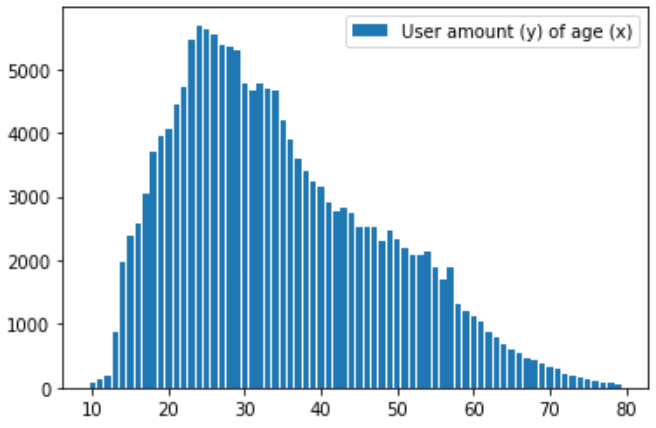
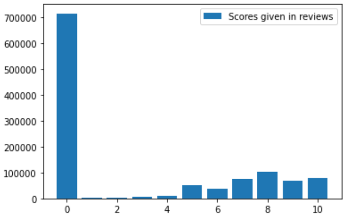

# Project Herexamen Data Mining Jim Vekemans

## Environment setup
1. Build [Hadoop Docker cluster](https://github.com/big-data-europe/docker-hadoop/archive/refs/tags/2.0.0-hadoop3.2.1-java8.zip)
2. Mount files from this repo in fastai container. <i>*Replace {DIRECTORY} with path where you cloned this repo*</i> ```docker run --init -it --rm --gpus all -p 8888:8888 -v {DIRECTORY}:/workspace/code fastdotai/fastai:2.2.5 ./run_jupyter.sh```
3. Download [Bookcrossing dataset](https://www.kaggle.com/arashnic/book-recommendation-dataset/download)
4. Run Recommenders_dataprep.ipynb
5. Copy mapred_data_{0-9}.csv to docker: ```docker cp ./mapred_data_{0-9}.csv```
6. Install maven dependencies and generate JAR-file -> open this repository in vscode and click "reopen in container". The JAR-file should be in target folder after container has been built

## Projectomschrijving

Een hypothetische data-pipeline beschrijven met uitgewerkte MapReduce implementatie en Recommendation system.

## Dataset

Voor deze individuele opdracht 'Data Mining' is er gekozen voor een dataset bestaande uit drie tabellen: users, books en ratings. In 2004 is gedurende vier weken data verzameld van gebruikers en gebruikerreviews op de website bookcrossing.com. Nadien is er op Amazon Web Services (AWS) informatie afgehaald over de boeken in de gebruikerreviews. Wanneer AWS geen informatie kon vinden over het boek in de review, werd de review uit de dataset verwijderd. Sinds december 2020 is de data beschikbaar in CSV-formaat op: kaggle.com/arashnic/book-recommendation-dataset.

#### Data visuals


De gemiddelde gebruiker op bookcrossing.com is tussen de 20 en 35 jaar oud. De leeftijdsverdeling in de dataset wijst er op dat naarmate de leeftijd toe neemt, boekenlezers minder online gaan om boekreviews te delen. 


De dataset is verzameld in 2004, wat duidelijk te zien is in het gebrek aan boeken die na deze periode in de data aanwezig zijn. Boeken die na 2004 zijn gepubliceerd zijn in de dataset beschikbaar indien de datum van eerste druk op voorhand bekend was.


Er zijn overheersend veel reviews die een score van 0 geven. Ik veronderstel dat dit de geschreven reviews zijn die geen bijhorende score hadden ingevuld. Voor het recommendation system worden deze 0-waardes weggelaten

## Theoretische big data pipeline

De dataset die tijdens dit project wordt gebruikt is al in bruikbaar formaat gebundeld om snel te kunnen starten met data-analyse. In een situatie waar de data nog niet voorbereid is zouden er verschillende aanpakken mogelijk zijn. Een hypothetische data-pipeline gebruik makend van de dataset is zichtbaar in onderstaande afbeelding:


### Data collection
De website bookcrossing.com bevat een lijst van gebruikers die in een 'journal' reviews geven aan boeken die ze hebben gelezen. Er is voor elke gebruiker een unieke gebruikersnaam, en gebruikers hebben optioneel opgegeven in welke provincie in welk land ze wonen. Bij elke journal-entry staat een hyperlink naar het boek in kwestie en bij elk boek staat een link naar verschillende webshops (waaronder Amazon) waar meer informatie staat over uitgeverij, auteur, enz.


### Data enrichment

In ons denkbeeldige scenario verzamelt bookcrossing.com dagelijks een grote hoeveelheid data in de vorm van nieuwe gebruikers, nieuwe boeken die worden geregistreerd en van gebruikers die een boek reviewen. Een webserver ontvangt de data die bookcrossing verzameld via een http POST-request en vult deze aan met informatie die a.d.h.v. API-calls of webscraping op Amazon werd gevonden bij het zoeken naar de ISBN-waarde die van bookcrossing werd afgehaald. De aangevulde data wordt nadien verstuurd via POST-request naar NiFi.

### Data storage

NiFi is verantwoordelijk voor het opslaan van de inkomende data op de juiste locatie. Een kopie van ongewijzigde data wordt opgeslagen in hadoop distributed filesystem (HDFS), wat verantwoordelijk is voor het bewaren van een robuuste kopie van de data die bestand is tegen hardwarefalen. Naast het opslaan van onbewerkte gegevens stuurt NiFi de data door naar Kafka a.d.h.v. een <i>publisher</i>. Kafka slaat de data van de publisher op in een tijdelijke buffer, en bevat twee topics:

- boeken die een nieuwe review hebben ontvangen
- gebruikers die een nieuwe review hebben geplaatst

De data van deze topics zijn beschikbaar voor NiFi om op te <i>subscriben</i> en data die NiFi hiervan ontvangt, worden doorgestuurd naar een MySQL database die tabellen bevat voor gebruikers, boeken en reviews.

### (Mock-up) Front-end

In dit voorbeeld heeft bookcrossing een webpagina waar iemand kan zoeken in de boekendatabase en naast het zoekresultaat, worden er ook een aantal boeken aanbevolen. Het uitgewerkte voorbeeld voor de MapReduce functionaliteit is een zoekopdracht naar hoeveel boeken er per uitgeverij zijn uitgebracht. Er is ook een Recommendation system aanwezig dat boeken aanbeveelt op basis van ratings van gelijkaardige gebruikers en/of op basis van ratings van gelijkaardige boeken. Onderstaande afbeelding is een mockup van de webpagina die voor dit project zou gebruikt worden.


(Deze mockup is gebaseerd op functionaliteit aanwezig op bookcrossing.com)

## MapReduce

### Waarom MapReduce?

Relationele databases zijn niet geschikt om de petabytes aan data te verwerken die bij Big Data aan bod komen. Niet enkel komen er enorm veel problemen opduiken voor een infrastructuur te bouwen die veilig met zulke omvang van data kan omgaan, er is al snel een supercomputer nodig om niet dagenlang te moeten wachten bij elke data-interactie.

De kracht van MapReduce is dat data op een grote hoeveelheid (relatief goedkope) machines wordt opgeslagen en elke machine lokaal data-interactie kan doen. Op die manier kan er niet alleen sneller data worden verwerkt, het staat het systeem ook toe om snel meer rekenkracht toe te voegen door middel van extra computers aan te sluiten in de cluster.


### MapReduce implementatie

Voor dit project zijn er twee mapreduce jobs opgesteld: een job waar het aantal boeken van een uitgeverij wordt teruggeven als nummer, en een andere job waar per uitgeverij een lijst van boektitles wordt teruggegeven. Deze mapreduce jobs staan met elkaar in verbinding wanneer de gebruiker zoekt naar een bepaalde uitgeverij. De webpagina roept dan beide mapreduce jobs aan en toont hiervan de inhoud als resultaat.

De mapreduce job die het aantal boeken toont krijgt als input 1 regel van de dataset gemarkeerd met een LongWritable die de index aangeeft. De Map-functie geeft hier als resultaat altijd een Key-Value paar met Key: Text (naam uitgeverij) en Value: een IntWritable van 1 terug (omdat er per regel maar 1 boek is van 1 uitgeverij). De Reduce-functie combineert per Key/uitgeverij alle Values om de som van boeken te bekomen.

De mapreduce job die de titles van de boeken toont krijgt ook als input 1 regel van de dataset gemarkeerd met een LongWritable die de index aangeeft. De Map-functie geeft hier als resultaat een Key-Value paar met Key: Text (naam uitgeverij) en Value: Text (titel van het boek). De Reduce-functie combineert per Key/uitgeverij alle Values in een lange string die de titles opsomt gesplitst door een ';'.

## Recommendation System

Er is voor dit project gewerkt aan twee recommendation systems: user-item gebaseerd en item-item gebaseerd.

#### User-item based recommendations
Gebruikers die reviews achter laten bouwen onbewust een profiel op dat vertelt welk soort boeken ze interessant vinden. Door te kijken naar boeken die door de gebruiker (A) goed werd ontvangen kan er worden vergeleken met andere gebruikers die dezelfde of gelijkaardige boeken ook leuk vonden (B). Als gebruiker B een boek leuk vond die gebruiker A nog niet heeft gelezen dan is de kans groot dat gebruiker A dat boek ook leuk zou vinden. A.d.h.v. k-nearest neighbours wordt bepaald hoeveel een bepaalde gebruiker B overeenkomt met gebruiker A. Gebruikers die het meest overeenkomen worden dan gebruikt voor de aanbevelingen te doen.

Demo for user-item recommendation system:


#### Item-item based recommendations
Wanneer er een grote dataset van boeken is (met reviews) kan er op basis van de reviews een onderverdeling worden gemaakt in genres van boeken. Door Singular Value Decomposition (SVD) toe te passen kan er een gok worden gemaakt welke boeken samenhoren in eenzelfde genre. Dit gebeurt door profielen van gebruikers te matchen met ratingpatronen voor groepen van boeken. Dit werkt het best bij gebruikers die veel boeken hebben reviews gegeven. Na SVD genres heeft ingedeeld in de dataset van boeken kan er voor elk boek worden gekeken naar het genre van dat boek. Boeken die goede reviews hebben ontvangen en in hetzelfde genre zitten als boeken die de gebruiker leuk vond worden dan aangeraden aan de gebruiker.

Demo for item-item recommendation system:


## Reflection

Deze opdracht heeft mijn interesse in Data Mining zeker aangewakkerd. Er zijn op bepaalde momenten problemen voorgevallen bij het starten van de MapReduce Job door het werken met verouderde libraries in Java. Ik heb tijdens programmeren in Java altijd berust op debugging om problemen op te lossen maar bij het ontwikkelen van de MapReduce jobs kon ik alleen maar een kaarsje te branden en hopen dat het werkte. Op een bepaald moment was ik aan het lezen over hoe MapReduce precies werkt met welke Key-Value pairs en plots klikte de logica bij me. Ik denk dat een diepere duik in de interne werking me enorm heeft geholpen met het concept MapReduce onder de knie te krijgen.

Oorspronkelijk was ik op zoek naar verschillende datasets omdat ik niet goed wist of ik met eenzelfde dataset een samenhorend geheel zou kunnen opbouwen. Na wat zoeken en niets vinden wat me aanstond ben ik creatiever gaan denken met de dataset en heb dat idee op Google Draw uitgewerkt in een leuk overzicht van de pipeline. Nadien heb ik in Paint 3D een mockup gemaakt van de website die dit project zou gebruiken en in een NiFi-container de workflow van mijn pipeline gerepliceerd. Door dit spelen met het idee en het in NiFi na te bootsen ondekte ik pas hoe simpel NiFi is om mee te werken. Dat was me voor dit project nog niet opgevallen.

Tijdens het uitschrijven van dit verslag en het maken van de visuals die erbij horen ontdekte ik pas dat er foutjes zaten in de dataset die me oorspronkelijk niet waren opgevallen. Ratings die vaak 0 bleken te zijn en gebruikers die 200 jaar of ouder opgeven als leeftijd zijn allemaal data die tijdens het schrijven nog behandeld zijn in de recommender systems. De resultaten van de item-item based recommendations lijken ook beter te zijn nu de 0-ratings niet meer worden meegenomen.

Uiteindelijk was dit een enorm leuk project en ik vind het spijtig dat ik er in het eerste semester niet aan heb deelgenomen.