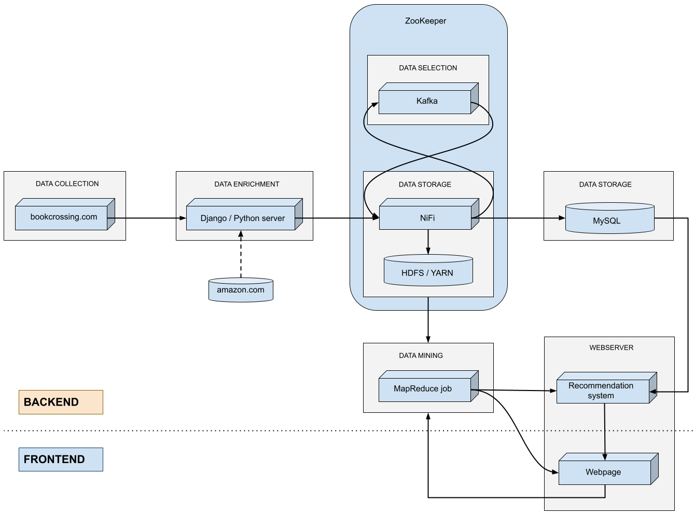

# Project Herexamen Data Mining Jim Vekemans

[Download dataset]: www.kaggle.com/arashnic/book-recommendation-dataset	"Bookcrossing dataset"

## Projectomschrijving

Een hypothetische data-pipeline beschrijven met uitgewerkte MapReduce implementatie en Recommendation system.

## Dataset

Voor deze individuele opdracht 'Data Mining' is er gekozen voor een dataset bestaande uit drie tabellen: users, books en ratings. In 2004 is gedurende vier weken data verzameld van gebruikers en gebruikerreviews op de website bookcrossing.com. Nadien is er op Amazon Web Services (AWS) informatie afgehaald over de boeken in de gebruikerreviews. Wanneer AWS geen informatie kon vinden over het boek in de review, werd de review uit de dataset verwijderd. Sinds december 2020 is de data beschikbaar in CSV-formaat op: kaggle.com/arashnic/book-recommendation-dataset.

## Situering in big data pipeline

De dataset die tijdens dit project wordt gebruikt is al in bruikbaar formaat gebundeld om snel te kunnen starten met data-analyse. In een situatie waar de data nog niet voorbereid is zouden er verschillende aanpakken mogelijk zijn. Een hypothetische data-pipeline gebruik makend van de dataset is zichtbaar in onderstaande afbeelding:

### Overzicht pipeline
De website bookcrossing.com bevat een lijst van gebruikers die in een 'journal' reviews geven aan boeken die ze hebben gelezen. Er is voor elke gebruiker een unieke gebruikersnaam, en gebruikers hebben optioneel opgegeven in welke provincie in welk land ze wonen. Bij elke journal-entry staat een hyperlink naar het boek in kwestie en bij elk boek staat een link naar verschillende webshops (waaronder Amazon) waar meer informatie staat over uitgeverij, auteur, enz.

Via webscraping op bookcrossing.com kan er een lijst van gebruikers worden opgesteld, een lijst van 'journals'/reviews en een lijst van boeken. De lijst van boeken kan verder worden aangevuld met informatie op amazon.com a.d.h.v. de ISBN die van bookcrossing werd afgehaald.